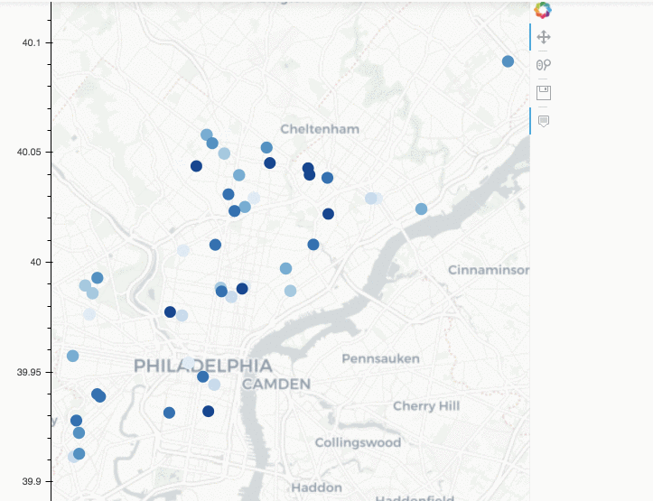

# Rental Profit Analysis

> An analysis about potential rental profit of properties for sale

Rental investment is a popular choice for people to diversify their investment portfolio. When chosen wisely, a rental property can lead to great profit, and produce steady and rewarding cashflow. However, the process can also involve high risk,  which makes choosing which the property to buy an important decision. The number of listings on the housing market makes this decision process overwhelming and challenging. This project is to make a web application to provide users with guidance to choose the most profitable rental investment property listed on the market.  

Here is a demo of the product for Philadelphia. 
The outline for this analysis is:
- I scraped data from publicly available source to get info about properties listed on the market in Philadelphia
- Cleaned and imputed data to get a dataset including address, sales or rental price, number of bedroom, number of bathroom, living area, lot size, year built, tax assessment value, and pictures. 
- Based on the properties for rent data, I built a predictive model to predict rental price with house features
- Use the predictive model to estimate rental price for the properties listed for sale. 
- Factoring in property tax, HOA fees, and maintenance cost, I computed return on investment(ROI) for each property for sale. 
- ROI along with property info is presented on an interactive map. 

***Example: Top 30 profitable rental properties listed for sale in Philadelphia***

